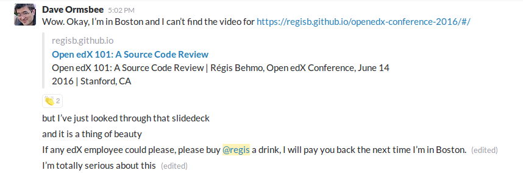

Open edX 2016 conference slides
===============================

This repo contains the slides from my talk: "Open edX 101: A Source Code Review". (06/14/2016)

Check out the slides in full screen: http://regisb.github.io/openedx-conference-2016/

The explanations given in the video help: https://www.youtube.com/watch?v=DVku7Y7XQII

Usage
-----

::

    git clone https://github.com/regisb/openedx-conference-2016 slides/
    firefox slides/index.html

Notes
-----

Not to show off or anything, but these slides got me free drinks:

